# Play Battlefield 2142 (Reclamation & Project Remaster) on Linux

   

> A step-by-step guide to installing and running **Battlefield 2142** with the **Reclamation Project** and the **Project Remaster** mod on Linux, using **Lutris + Wine + DXVK**.
>
> Written for **EndeavourOS**, with notes for other distros. Commands use `yay` (Arch-based).

*Having issues or in need of help? You can always ask questions in the [Battlefield 2142 Reclamation Discord](https://discord.gg/md9vFmqy8W) as well as [Battlefield 2142 Project Remaster Discord](https://discord.gg/VP9vpm74QY). Feel free to also ping me directly on those servers, I am always happy to (trying to) help.*

---

## Table of contents

- [Introduction](#introduction)
- [Prerequisites](#prerequisites)
  - [1. Updates and drivers](#1-updates-and-drivers)
  - [2. Installing Lutris](#2-installing-lutris)
  - [3. Installing Wine and Dependencies](#3-installing-wine-and-dependencies)
  - [4. Installing DXVK](#4-installing-dxvk)
- [Installing Battlefield 2142](#installing-battlefield-2142)
  - [1. Add and configure the environment](#1-add-and-configure-the-environment)
  - [2. Install the Base Game](#2-install-the-base-game)
  - [3. Install the 1.51 Patch and Hub](#3-install-the-151-patch-and-hub)
  - [4. Configure the Launcher](#4-configure-the-launcher)
  - [5. Apply OpenSpy patches](#5-apply-openspy-patches)
  - [6. Download the Reclamation map pack](#6-download-the-reclamation-map-pack)
  - [7. Running Battlefield 2142](#7-running-battlefield-2142)
- [Installing Battlefield 2142: Project Remaster](#installing-battlefield-2142-project-remaster)
  - [1. Why you should install it](#1-why-you-should-install-it)
  - [2. How to install](#2-how-to-install)
  - [3. Running Project Remaster](#3-running-project-remaster)
- [Known issues](#known-issues)
  - [Hub](#hub)
  - [Other distros](#other-distros)

---

# Introduction

This tutorial will show you how to install and run Battlefield 2142 on a Linux based distro.

Note that this tutorial is based on [EndeavourOS](https://endeavouros.com/), if you are feeling insecure and just want to precisely follow the guide step by step I recommend installing EndeavourOS. Else continue with your distro of choice.

**Disclaimer**: When using other distros, please note that I can not guarantee this to work exactly as shown here. While many steps will be (near) identical, installation steps in other distros can always differ and/or not be compatible with this exact setup.

Useful information and workarounds for other distros are found in the [Other distros](#other-distros) section of this guide.  

---

# Prerequisites

We are setting up your system so it is generally ready to play most games, not only Battlefield 2142. We will therefore install various components to ensure a smooth gaming experience on Linux using Wine and Lutris for Windows games.

The application where we will run the game from will be Lutris. Lutris is a comprehensive open-source gaming platform for Linux. It acts as a unified library to install, configure, and launch games from various sources, including Windows games (via Wine).  

---

## 1. Updates and drivers

Before starting, ensure your system is updated and the correct graphics drivers are installed, you can use the console to do so and run the following commands:

**Update the system using**

```bash
yay -Syu
```

**Install graphics drivers**

Select the command matching your hardware:

- For AMD GPUs

```bash
yay -S mesa lib32-mesa vulkan-radeon lib32-vulkan-radeon
```

- For NVIDIA GPUs

```bash
yay -S nvidia nvidia-utils lib32-nvidia-utils
```

- For Intel GPUs

```bash
yay -S mesa lib32-mesa vulkan-intel lib32-vulkan-intel
```

**Verify Vulkan support**

Check if Vulkan is working correctly:

```bash
vulkaninfo | less
```

If the command is not found, install the tools:

```bash
yay -S vulkan-tools
```

---
## 2. Installing Lutris

```bash
yay -S lutris
```

Once installed, launch it from your start menu or terminal by typing `lutris`.  

---

## 3. Installing Wine and Dependencies

Lutris can manage Wine versions for you, but installing a system-level base ensures better compatibility and prevents dependency issues.

**Installing Wine (Base, Gecko, and Mono)**

```bash
yay -S wine wine-gecko wine-mono
```

**Install critical 32-bit libraries**

Many Windows games/applications are 32-bit and require these specific libraries to run with audio and controller support:

```bash
yay -S lib32-gnutls lib32-libldap lib32-mpg123 lib32-openal lib32-v4l-utils lib32-libpulse lib32-alsa-plugins lib32-libxcomposite lib32-libxinerama lib32-ncurses lib32-libxml2 lib32-freetype2 lib32-libpng lib32-sdl2
```

**Install Winetricks**  
This helper script allows you to easily install various Windows libraries (DLLs) needed for specific games so it never hurts to install this.

```bash
yay -S winetricks
```

---

## 4. Installing DXVK

DXVK translates DirectX calls to Vulkan, vastly improving performance for Windows games. While Lutris often handles this per-game, you should install it system-wide.

```bash
yay -S dxvk-bin
```

---

# Installing Battlefield 2142

This section covers installing the game using original media or a backup copy. As most of us have no DVD drive at hand anymore, you can safely go the backup copy route.

Before beginning the installation in Lutris, ensure you have the following files ready:

* **Installation Media:** A physical DVD of Battlefield 2142 or [backup copy](https://docs.getbf2142.net/getting-started/download-and-install-bf2142)  
* **Serial Key:** A valid key for installation. (also see previous link above for more information)  
* **The 1.51 Full Patch:** Available [here](https://docs.getbf2142.net/getting-started/download-and-install-v1_51-patch)  
* **The Reclamation Project Hub Installer:** Available [here](https://docs.getbf2142.net/getting-started/download-and-install-bf2142-hub)

---

## 1. Add and configure the environment

1. **Open Lutris and click the + icon (Add locally installed Game)**.  
   **Important:** **DO NOT** pick “Install a Windows game from an executable, **it will fail!**)

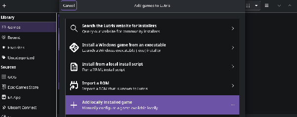

2. **Game Info Tab:**  
   * **Cover:** (optional, if you would like to add a cover image in the launcher)  
      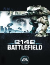  
   * **Name:** BF2142  
   * **Runner:** Wine

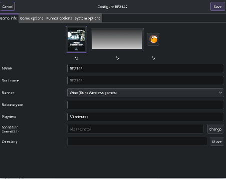

3. **Game Options Tab:**  
   * **Executable:** Browse to your mounted media or backup copy and select `setup.exe`. (unzip folder first in case you are using a backup copy)  
   * **Wine Prefix:** Create a new folder on your system for the game and select it here. (e.g., `~/Games/bf2142`).  
   * **Working Directory:** Set this to the same folder as the Wine Prefix, (e.g., `~/Games/bf2142`)

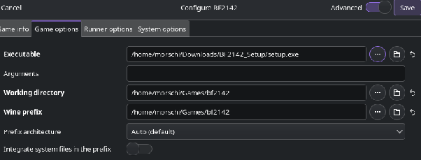

4. **Runner Options Tab:**  
   * **Wine Version:** Select a recent **System** Wine build (10.20 was used for this initially).  
     1. Wine build 11.0 has now been tested by me and is compatible as well.  
     2. Some distros such as Nobara have issues with this version. Refer to the Known issue area for an alternative configuration [here](#other-distros).  
   * **DXVK Version:** Ensure a recent version is selected (v2.6.2 was used for this tutorial)  
   * **Enable Esync:** Toggle this On.  
   * **Enable Fsync:** Toggle this On.  
   * Settings are left pretty much standard as is seen in the screenshot below.

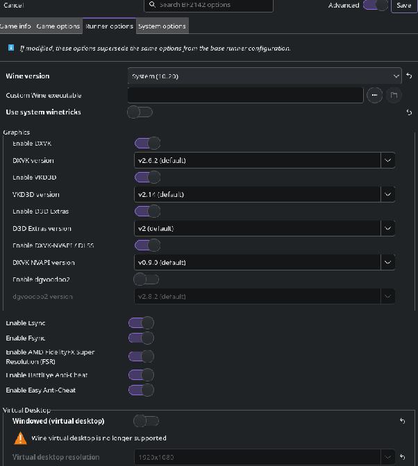

5. **System options**  
   * If you are using a laptop with both a discrete and dedicated GPU, I recommend selecting your dedicated GPU here to prevent issues.

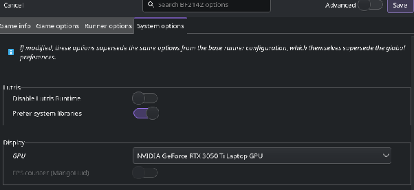

6. **Click Save** in the right corner on top - We do not want to lose everything we just configured. 🙂

---

## 2. Install the Base Game

1. Select **Battlefield 2142** in Lutris and click **Play**.  
2. The standard game installer will launch. Proceed through the installation steps using your Serial Key.  
3. Do not change the install directory of the game.  
4. Feel free to skip BattleCammo setup by clicking **Cancel**.  
5. Select **No, install GameSpy Comrade later** to skip GameSpy Comrade setup.  
6. When asked to register an EA account, just click **REGISTER LATER** to move on.  
7. None of the multiplayer servers use PunkBuster anti-cheat anymore, so you can skip installing it.  
8. Once the installation finishes, **do not** launch the game yet. Close the installer.

---

## 3. Install the 1.51 Patch and Hub

To avoid path issues, it is recommended to move your downloaded patch files into the virtual Windows drive created by Lutris.

1. Copy the **1.51 Full Patch** and the **Hub Installer** into your Wine Prefix's `drive_c` folder (located in the folder you created in Step 1), e.g. `/home/xxxxx/Games/bf2142/drive_c/`

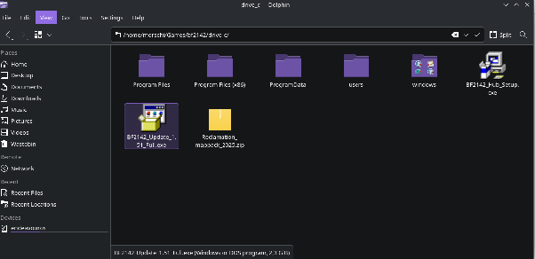

2. In Lutris, right-click Battlefield 2142 and select **Run EXE inside Wine prefix**.

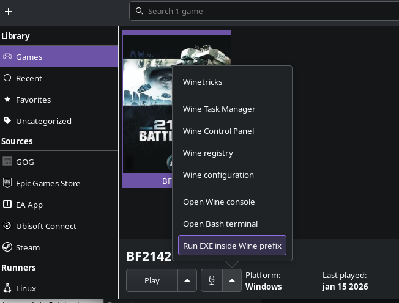

3. Select the **1.51 Full Patch** executable. Follow the prompts to install.  
   * *Note: If you receive an error about a newer version, ensure you are using the "Full" patch, not the incremental one.*

*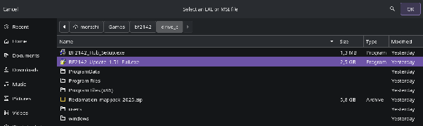*

4. Once the patch is finished, repeat the process once more for the Hub: right-click the game, select **Run EXE inside Wine prefix**, and run the **Hub Installer**.


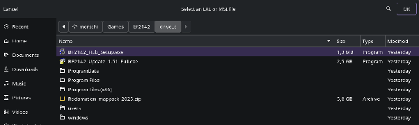

---

## 4. Configure the Launcher

Now that the Hub is installed, you must point Lutris to the new executable.

1. Right-click Battlefield 2142 in Lutris and select **Configure**.  
2. Go to the **Game Options** tab.  
3. Change the **Executable** path to the installed Hub. It should look similar to:  
    `/path/to/prefix/drive_c/Program Files (x86)/BF2142 Hub 2/BF2142 Hub.exe`  
   **In our specific case:**  
   `/home/xxxxx/Games/bf2142/drive_c/Program Files (x86)/BF2142 Hub 2/BF2142 Hub.exe`

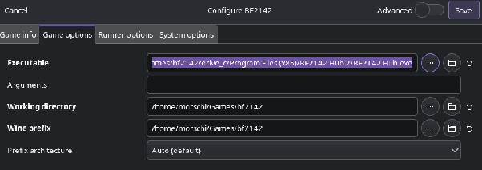

4. Click **Save**.  
5. Launch the game in Lutris. The BF2142 Hub launcher should appear.

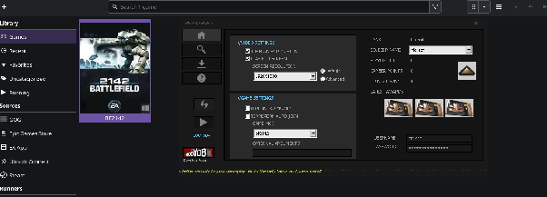  

---

## 5. Apply OpenSpy patches

- Go to the Help tab (the question mark icon) and check if the GamePath is set to the correct folder. If it isn't, click the gear icon to locate your game folder.  
- It is recommended to set and save this path once more in case you are encountering issues.  
- From the **Redirects** drop-down menu, select OpenSpy and click Install.  
- When asked Are you sure you want to patch the game?, click Yes .  
- Once you see the patch completed, Enjoy!, click Confirm.

**Hint 1:** Note that this step can throw an error message. You can simply hit confirm on the error message and the task will still be completed afterwards.

**Hint 2:** After patching, make sure the checkmarks for `Patch 1.51`, `BF2142.exe`, `RendDX9.d`, `RendDX9ori.dll` are all green. If any aren't, repeat all steps from this section. Oftentimes, resetting the GamePath instantly resolves the issue when you just opened this for the very first time.

**Hint 3**: In case you encounter a black window when opening the Help tab,, simply click the banner in the bottom right corner. The elements will become visible.

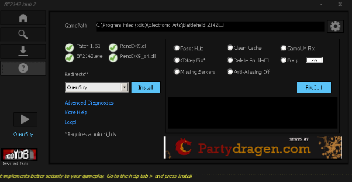

---

## 6. Download the Reclamation map pack

1. Inside the Hub launcher, click the **Downloads** icon on the left.  
2. Double click on the BF2142 Reclamation Map Pack entry on the right.  
3. This will redirect you to ModDB to download the map pack. As of the point of writing this tutorial, [here is the direct link.](https://www.moddb.com/games/battlefield-2142/downloads/bf2142-reclamation-map-pack-march-21st-2025) Download the map pack.  
4. Close the Hub launcher for now.  
5. Extract the downloaded `.zip` file in your Download folder  into your Wine Prefix's `drive_c` folder, just like we did before with the 1.51 patch and Hub.  
6. In Lutris, start Battlefield 2142 to open the Hub  
7. Navigate to the **Downloads** icon again and use the MapPack Installer to select the map pack and install it automatically.  
   1. **If you run into issues, you can apply the map pack manually**. You can safely terminate the running MapPack installer window/application.  
   2. Simply extract the contents of the downloaded file directly into your battlefield 2142 maps directory, in our case `/home/xxxxx/Games/bf2142/drive_c/Program Files (x86)/Electronic Arts/Battlefield 2142/mods/bf2142/Levels/`  
      1.  `OVERWRITE ALL EXISTING FILES/FOLDERS IF PROMPTED`  
      2. `BE SURE NOT TO EXTRACT IT INTO /Levels/Levels !`

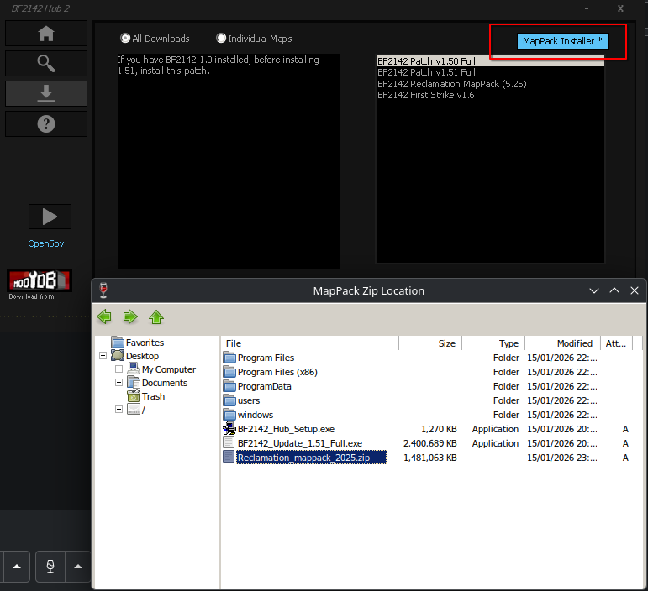

---

## 7. Running Battlefield 2142

Once the installation is complete, you can launch Battlefield 2142 directly from Lutris via the Hub. Congratulations!

**Hint**: If you do not have an account yet, make sure to create one [as instructed here](https://docs.getbf2142.net/getting-started/create-account)

- At the login screen, click CREATE NEW ACCOUNT. It might take a moment for the next screen to appear  
- Click ACCEPT TERMS  
- Fill out the registration form and make sure to remember your EMAIL ADDRESS, ACCOUNT NAME and PASSWORD.  
- Click CREATE. If you received an error, then try to disable your VPN, or change your region in your VPN.  
- Click CREATE NEW SOLDIER.  
- Enter the SOLDIER NAME you want to use in-game and click CREATE NEW SOLDER.

**Welcome to Battlefield 2142, soldier!**

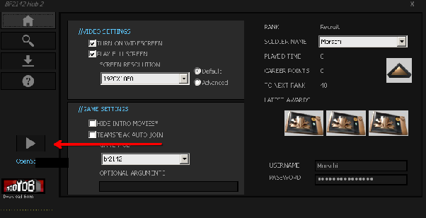

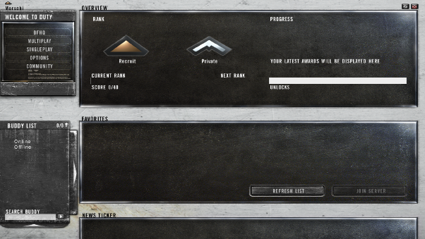

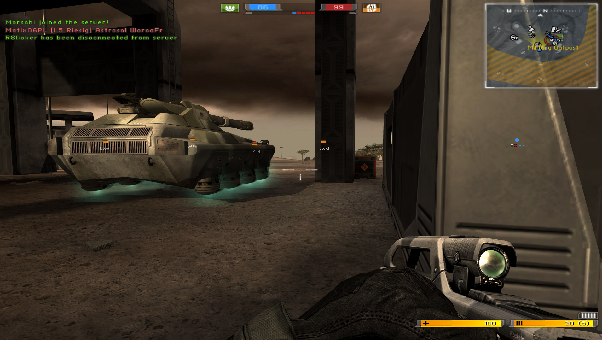

---

# Installing Battlefield 2142: Project Remaster

## 1. Why you should install it

While the Reclamation Project brings the game back to live, the **Battlefield 2142 Project Remaster** mod improves on the graphics and gameplay and injects Battlefield 2142 with fresh content. It is a comprehensive overhaul that respects the original art direction while drastically improving visuals and introducing new content to explore.

Installing it is straightforward. If you made it this far, I strongly recommend you to install Project Remaster as well!

---

## 2. How to install

- Download the mod from [here](https://docs.getbf2142.net/advanced/project-remaster/install-project-remaster#downloads)  
- **Important**: I recommend joining the Battlefield Remaster [Discord](https://discord.gg/VP9vpm74QY) to get access to the latest beta builds, should you be interested in testing the newest features!  
- Extract the content from the `.zip` file into the game's mods folder, in our case located at `/home/xxxxx/Games/bf2142/drive_c/Program Files (x86)/Electronic Arts/Battlefield 2142/mods/`

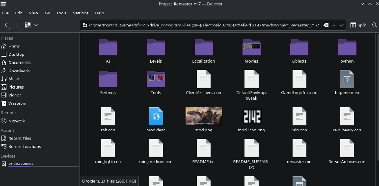

---

## 3. Running Project Remaster

- Once the extraction is complete, you can launch Battlefield 2142: Project Remaster directly from Lutris via the Hub.  
- Select the Remaster mod from the dropdown and start the game using the Play button

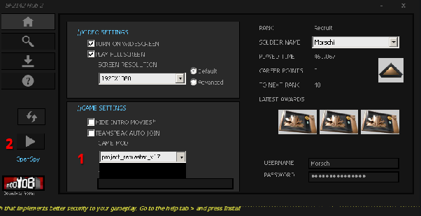

**Welcome to Project Remaster, soldier!**

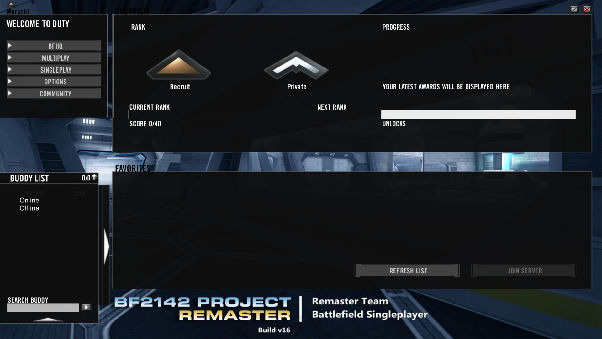

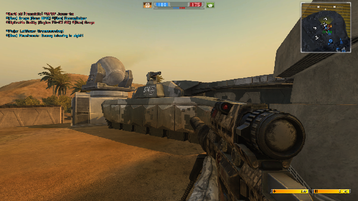

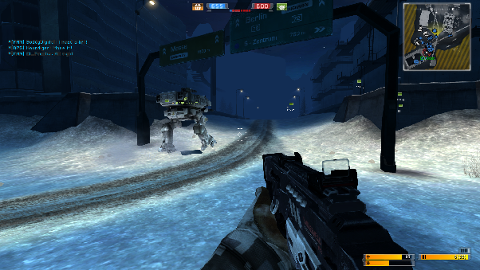

---

# Known issues

## Hub

1.Dropdowns can be glitchy and only display a black box. This is the case for options such as SCREEN RESOLUTION as well as GAME MOD dropdown. You will have to click the desired value by trial and error. If I find a way to resolve this I will update the guide accordingly.  
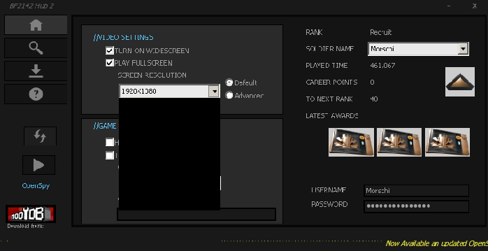

2.In case you encounter a black window when opening the Help tab, simply click the banner in the bottom right corner. The elements will become visible.


Minimising the hub window and opening it again can help as well.  

---

## Other distros

**Nobara (confirmed)**

+ **(other distros potentially)**

If you are using Nobara Linux, you might  have to change the Wine version in the Runner options to the default option when [setting up your Battlefield 2142 environment in Lutris](#1-add-and-configure-the-environment):

User reports indicate that the **System 10.20 wine version** under Runner options will sometimes not work. An alternative is to use the default Wine runner, which is **wine-ge-8-26-x86_64 (default)** at the time of writing this tutorial.  
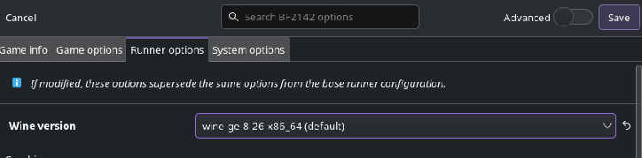  
**This might resolve issues for distros as well and is always worth a shot!**  

---

# Changelog
All recent changes are logged here.  

If you have feedback or other helpful information, feel free to reach out to me in Discord so they can be implemented!  

---

## 1.0.0 - 2026-01-16

Initial Release of the guide  

---

## 1.0.1 - 2026-01-17

- Adding “Known issues” section  
- Adding Wine config fix for other  Linux distros, including a confirmed Nobara report and fix.  
- Fixing Map pack installation steps to correctly point out the automatic extraction process in the hub, added screenshot.  
- Added info on Hub dropdown black box issue, including a screenshot.  
- Additionally mentioned Hub “Help tab” black screen issue at Known issues, added screenshot.  
- Updated Titles for consistency  
- Fixed internal links  
- Reworked introduction

Special thanks to community member lt.chris for the feedback!  

---

## 1.0.2 - 2026-01-21

- Confirmed: System Wine 11.0 compatibility, added info at Lutris configuration during Runner setup

---

## 1.0.3 - 2026-02-07

- Added clarification on serial keys requirement  
- Added a second workaround for black hub window  
- Fixed some spelling mistakes  

---

## 1.0.4 - 2026-07-11

- Added hint with steps for account creation

---

---

## About

- **Guide version:** 1.0.4 (2026-07-11)
- **Author:** Morschi
- **Original guide:** based on the Battlefield 2142 Reclamation / Project Remaster community docs

This README was reformatted from the original guide for GitHub. All screenshots live in [`images/`](images). Get help on the [Reclamation Discord](https://discord.gg/md9vFmqy8W) or the [Project Remaster Discord](https://discord.gg/VP9vpm74QY).
